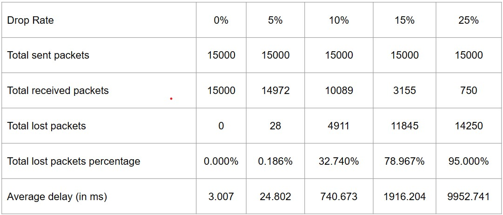
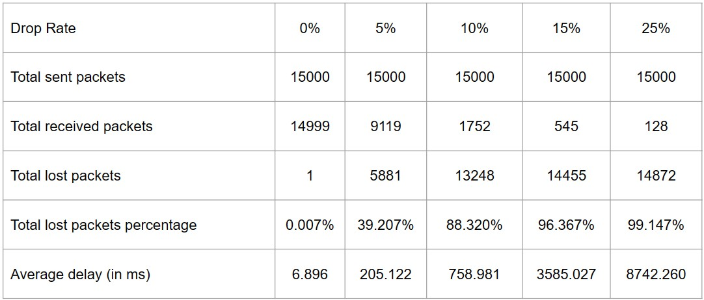
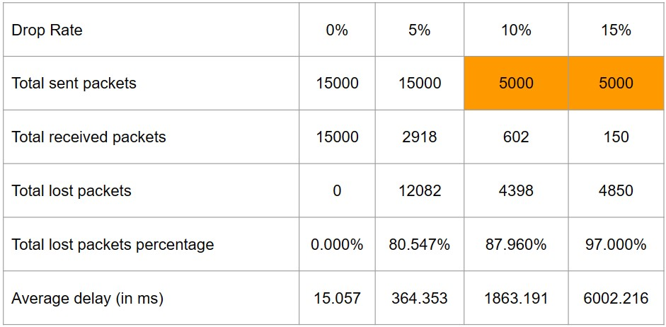
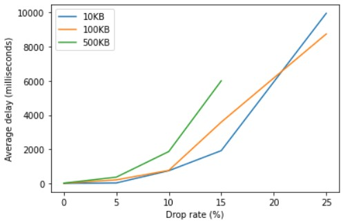
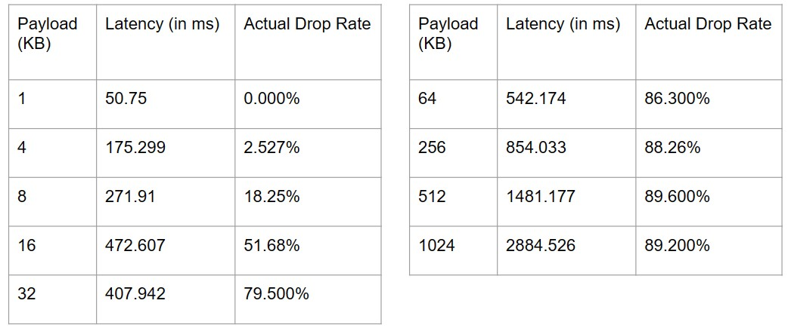
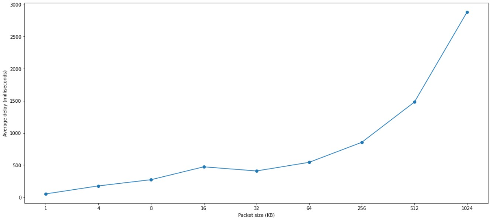
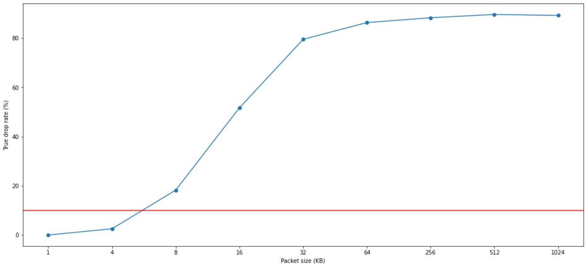

# Final Report
[Final Presentation Slide](https://docs.google.com/presentation/d/1SkCbEIhDRaicBq9CKs7uvKqYfcbhvSPdxF_UKV29MhY/edit?usp=share_link)

## Table of Contents

- [Final Report](#final-report)
  - [Table of Contents](#table-of-contents)
  - [Objective](#objective)
    - [About Packet Drop Rate (From Wikipedia)](#about-packet-drop-rate-from-wikipedia)
  - [Methods](#methods)
    - [INET + Veins + Sumo](#inet--veins--sumo)
      - [Why is this method unpractical](#why-is-this-method-unpractical)
    - [INET + Emulation](#inet--emulation)
    - [Adjust Packet Drop Rate](#adjust-packet-drop-rate)
      - [Preface](#preface)
      - [Experiment Setup](#experiment-setup)
      - [Experiment 1 - Different Packet Drop Rate vs. Latency](#experiment-1---different-packet-drop-rate-vs-latency)
        - [10 KB Payload](#10-kb-payload)
        - [100 KB Payload](#100-kb-payload)
        - [500 KB Payload](#500-kb-payload)
      - [Result Visualization](#result-visualization)
      - [Experiment 2 - Different Payload Size vs. Latency](#experiment-2---different-payload-size-vs-latency)
        - [Payload Size vs. Average Delay with 10% Drop Rate Noise](#payload-size-vs-average-delay-with-10-drop-rate-noise)
        - [Payload Size vs. Actual Drop Rate with 10% Drop Rate Noise](#payload-size-vs-actual-drop-rate-with-10-drop-rate-noise)
      - [Experiment Conclusion](#experiment-conclusion)
      - [Packet Analysis](#packet-analysis)
        - [10KB Payload Size with 0% Drop Rate](#10kb-payload-size-with-0-drop-rate)
        - [10KB Payload Size with 5% Drop Rate](#10kb-payload-size-with-5-drop-rate)
        - [10KB Payload Size with 10% Drop Rate](#10kb-payload-size-with-10-drop-rate)
  - [Conclusion](#conclusion)

## Objective

There are a lot of pub/sub protocols for v2v, such as `mqtt`, `zenoh`, and `kafka`. They all perform great in a closed network. But in real world scenerio, there are usually a lot of noises, like Wi-Fi, celluar network, and bluetooth. These noises could lead to packet loss and message delay, which would hurt the performance of these protocols.
We want to simulate a environment that is close to the real world scenerio, and see how different protocols deal with these.

### About Packet Drop Rate (From Wikipedia)
- Losses between 5% and 10% of the total packet stream will affect the quality significantly."
- Less than 1% packet loss as "good" for streaming audio or video, and 1–2.5% as "acceptable".

## Methods

### INET + Veins + Sumo

Sumo is a simulator based on OMNet++, and is used to traffic simulation, while OMNet++ is focused on network simulation. And Veins is a package that makes Sumo work with OMNet++, let us combine the good in both sides.

[Demo video](https://drive.google.com/file/d/1CiNEqb_qyAmbVZknhGPgUhRbyxzlmtUo/view?resourcekey)

#### Why is this method unpractical
- VEINS & SUMO are used to simulate “events”, which means they are not for performance evaluation purposes.
- the instructions are unclear, so we couldn't customize it to fit our desired scnerio.
- Plus, integrating Zenoh into this setup seems hard to be done in a semester, so we decided to try out other methods.

### INET + Emulation
INET's feature, emulation, is a way to create a simulated network environment, and let real applications run on this simulated network.
We first tried to install INET on OMNet++ and try out the examples, but the versions are not compatiable. So we spent some time looking for compatiable versions of INET and OMNet++.

First, we modified the example. We first let two clients connect with ethernet like shown below. We succesfully run Zenoh on this simulated network environment. However, the results aren't as expected. With a 100M link speed and without any noises, there are still some packet loss. After some discussion, we think the cause of this might be these reasons:
- Our computation resource (my laptop) isn't powerful enough to compute the emulation process in real time, thus leads to some packet loss
- We send data too fast, which made the router's waiting queue full, and router drops the packet

We decided to try a powerful computer to eliminate the possibility of insufficient computation resource leading to packet loss, while attempting to modify the network environment into wireless mode.

Unfortunately, we failed to convert the network environment into wireless mode. The wireless client couldn't receive any packet or send any packet.
We inspected the packet record for the router and discovered that although router gets an ARP request from the wireless client asking for the mac address for another client, the router doesn't respond to that request, thus make the wireless client unable to do transmission or receive any packet. 

We couldn't find any documentation about this problem, and we couldn't think of a way to resolve it. Moreover, we didn't see any options to increase the router's buffer size.
Beause of the computation overhead and configuration problem, we don't think INET emulation is a appropriate way of evaluating network performance.

### Adjust Packet Drop Rate
Due to the problems encountered in the previous two methods, we decide to use a more simple method to simulate the packet drop rate. We use `iptable`, which is a module that enables user to take control of the packet flow. We use `iptables` to drop some packets, and see how the protocols deal with it.

#### Preface

Reasons of packet loss:
* Transmission too fast, the queue is full, so the node would drop the packet
* When SNR is too low, the node couldn't decode the packet correctly, so the packet would be dropped 

Here's a diagram about SNR and packet loss rate, with different packet size:

This diagram can also serve as a heads up to how distance affect the coneection reliability of a v2v scnerio.
For example, within 60m, the SNR would be strong enough to transmit every packet without loss (if there aren't any other noise interference).
In a v2v scenerio, veichles could be in different positions and have different distances, we think that it would be a good idea to measure how Zenoh would perform in different packet loss rate and different packet size.

#### Experiment Setup
* 2 VMs, one for the publisher, one for the subscriber
  * RAM: 6GB
  * CPU: 4 cores
  * Network: Host-Only (to avoid other interference)
  * iso: archlinux-2022.12.01-x86_64.iso
* Randomly drop different percentage of packets using `iptables` to simulate packet loss in a noisy environment
* [Environment Setup](https://hackmd.io/n1MLnX2DQ6K1USQNakiXMQ)

#### Experiment 1 - Different Packet Drop Rate vs. Latency
In this experiment, we use `zenoh` as the pub/sub protocol. We sent 15000 messages with 10, 100, 500 KB payload and randomly drop 0%, 5%, 10%, 15%, 25% of the packets. We record the latency of each message, and plot the result. The result is shown below.

##### 10 KB Payload

##### 100 KB Payload

##### 500 KB Payload

In this scenario, we only drop 0, 5, 10, 15% of the packets due to the limitation of the machines and time. And we only sent 5000 packets in 10% and 15% drop rate scenarios due to the same reason. 

#### Result Visualization
We use `matplotlib` to plot the result. The picture is shown below:  

  

From above figure, we can see that latency indeed increases when drop rate increases, and larger payload size leads to higher latency. But what is more interesting is that around 22% drop rate, the latency of 100KB payload is lower than 10KB payload. We think this is because 10KB payload is very small, and the protocol will try to resend the message, which leads to higher latency. But when the payload becomes larger, 
#### Experiment 2 - Different Payload Size vs. Latency
In this experiment, we use `zenoh` as the pub/sub protocol. We fix drop rate to 10%, and sent 15000 packets with 1, 4, 8, 16, 32, 64, 256, 512, 1024 KB payload. We record the average delay and actual drop rate, and plot the result. The result is shown below.

##### Payload Size vs. Average Delay with 10% Drop Rate Noise

From above result, we can see that the average delay increases when payload size increases. And if 500ms is the maximum acceptable delay, then we should try to prevent sending payload larger than 64KB.

##### Payload Size vs. Actual Drop Rate with 10% Drop Rate Noise

From above result, we can infer that if there exists a noisy environment with 10% packet drop rate, then maybe dividing the payload into 4 to 6KB chunks. Because this kind of payload size can achieve better performance in terms of latency and drop rate. 
#### Experiment Conclusion
- Zenoh and TCP perform well when sending 10KB message with 5% packet drop rate
- Need to improve
  - when sending 10KB message with 10% packet drop rate
  - when sending 100KB message with 5% packet drop rate
- Sending 500KB message is not recommended.
- In 10% drop rate environment, 4KB~6KB payload size is recommended.

#### Packet Analysis
##### 10KB Payload Size with 0% Drop Rate
- 一開始會是一個封包一個 ACK
- 之後如果網路都是順暢的，因為送很快，會兩個封包才傳一次ACK，所以 TCP 在收到後面的 ACK 之後會默認前面有收到

##### 10KB Payload Size with 5% Drop Rate
- 實際上的 drop rate: 0.186%
- 會開始有重送機制 (TCP retransmission)
- 一開始都很順，少部分發生 packet segmentation，變成使用兩個封包來傳送一則訊息
- 因為切成兩個訊息，所以也會收到兩個 ACK
- 在網路又變得更差之後，packet segmentation 會開始把封包切成更多份

##### 10KB Payload Size with 10% Drop Rate
- 實際上的 drop rate: 32.74%
- 會有很多的 retransmission，部分編號的封包沒有被記錄在 pcap 檔案中，推測是 Zenoh 的 buffer 爆掉了。

## Conclusion

- In 5% drop rate environment, zenoh performs well when sending message with 10KB size.
- We need to improve performance in 10% drop rate environment.
  - Compress data to convey more information in less payload size (1KB~6KB)
  - Try to reassemble packet to a proper packet size at sender
- There is still a lot of work to run zenoh on INET.

